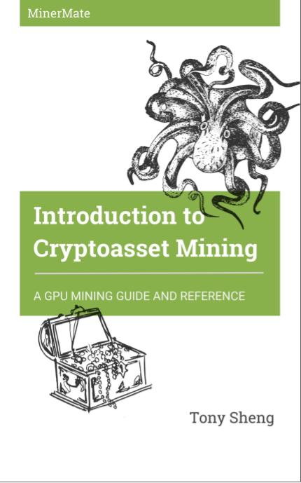

# Introduction to Cryptoasset Mining

## Book Source and Build System

This repository contains the source code for the book "Introduction to Cryptoasset Mining" by [Tony Sheng](https://twitter.com/tonysheng)

The source code of the book itself (/chapters) is licensed CC-BY-NC-ND

## Affiliate links and donations

To maintain objectivity, there are no affiliate links contained in this book. All Amazon links are Amazon Smile links. If you wish to support the author, you can donate BTC or ETH to the following addresses:

BTC: 17FzHrLW3wrb3S7CqZmbLn3hvSUXtg7wi4

ETH: 0x7a364D25c4b0830733d3470DDFFeA3B6979D6944

## Current version

Version 0: working draft

### Tasks

V0 tasks

- [x] Copy editing
- [x] Source all images
- [x] Link to helpful resources and suggested hardware

V1 tasks

- [ ] Acquire fresh assembly pictures for Section 3
- [ ] Get comment from GPU and PSU makers on power and cable safety
- [ ] Add sections for other OS (ethos, simpleos, linux)
- [ ] Source protips from experienced miners

V2 tasks

- [ ] Build a database of benchmarks by GPU, Algorithm, Miner, OC settings

## Contributing

The goal of this book is to provide an open-source resource for the cryptoasset mining community. Pull requests are encouraged. 

## Table of Contents

Introduction to Cryptoasset Mining

* [Introduction](content/introduction.mdown)
* [Section 1: Introducing cryptoasset mining](content/section1.mdown)
	* What is a cryptoasset?
	* What is mining?
	* How much can I make?
	* Is mining right for me?
* [Section 2: How do I mine?](content/section2.mdown)
	* How are cryptoassets mined?
	* What hardware do I need to mine?
		* ASIC Mining
		* GPU Mining
			* Graphics Cards
			* Power supplies
			* Motherboards, processors, and RAM
			* Risers
			* Other (e.g. SDD, Wifi stick, Keyboard, Monitor)
		* Tips for finding stock
	* How much does it cost?
		* Hardware costs
		* Electricity costs
		* Profitability
* [Section 3: Assembling and running your miner](content/section3.mdown)
	* Assess electrical requirements
	* Confirm compatability of hardware
	* Assemble miner
	* Install operating system
		* Windows
		* Linux
		* ethOS
	* Install drivers
	* Drivers
	* Flashing AMD BIOS
	* Mining software
	* Mining pool
	* Overclocking
	* What should I mine?
* [Section 4: Maintenance and protips](content/section4.mdown)
	* Maintenance
		* Remote monitoring
		* Crash management
		* Automatic start
	* Protips